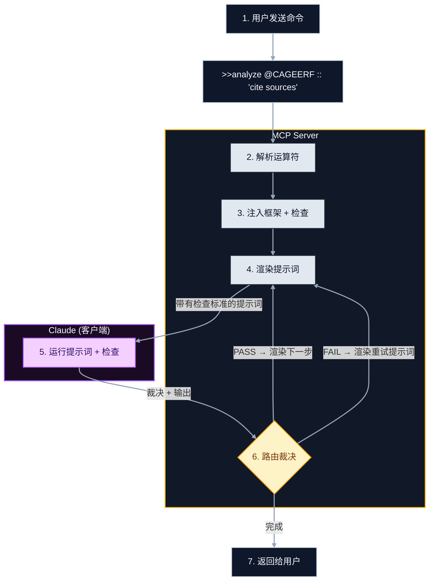

# Claude Prompts MCP Server

<div align="center">


[](https://www.npmjs.com/package/claude-prompts)
[](https://opensource.org/licenses/MIT)
[](https://modelcontextprotocol.io)

**为您的AI助手提供热重载提示词、结构化推理和链式工作流。专为Claude打造，可在任何地方工作。**

[快速开始](#快速开始) • [功能特性](#功能特性) • [语法参考](#语法参考) • [文档](#文档)

</div>

## 为什么使用

停止复制粘贴提示词。这个服务器将您的提示词库转变为可编程引擎。

- **版本控制** — 提示词是git中的Markdown文件。跟踪变更、查看差异、分支实验。
- **热重载** — 编辑模板，立即运行。无需重启。
- **结构化执行** — 不仅仅是文本。服务器解析运算符、注入方法论、强制执行质量检查、渲染最终提示词。

## 快速开始

MCP客户端会自动启动服务器——您只需配置并连接。

### 选项1：NPM（最快）

在您的`claude_desktop_config.json`中添加：

```json
{
  "mcpServers": {
    "claude-prompts": {
      "command": "npx",
      "args": ["-y", "claude-prompts@latest"]
    }
  }
}
```

重启Claude Desktop。使用以下命令测试：`prompt_manager(action: "list")`

**就是这样。** 客户端会处理其余工作。

---

### 选项1b：NPM使用自定义提示词

想要自己的提示词而不克隆仓库？创建一个工作区：

```bash
npx claude-prompts --init=~/my-prompts
```

这将创建一个带有入门提示词的工作区。然后将Claude Desktop指向它：

```json
{
  "mcpServers": {
    "claude-prompts": {
      "command": "npx",
      "args": ["-y", "claude-prompts@latest"],
      "env": {
        "MCP_WORKSPACE": "/home/YOUR_USERNAME/my-prompts"
      }
    }
  }
}
```

重启Claude Desktop。您的提示词现在支持热重载——直接编辑它们，或让Claude更新它们：

```text
用户: "让quick_review提示词也检查TypeScript错误"
Claude: prompt_manager(action:"update", id:"quick_review", ...)  # 自动更新
```

查看[服务器README](server/README.md#configuration)获取所有配置选项。

---

### 选项2：从源代码安装（用于自定义）

如果您想编辑提示词、创建自定义框架、检查或贡献，请克隆：

```bash
git clone https://github.com/minipuft/claude-prompts-mcp.git
cd claude-prompts-mcp/server
npm install && npm run build
```

然后配置Claude Desktop使用您的本地构建：

**Windows：**

```json
{
  "mcpServers": {
    "claude-prompts": {
      "command": "node",
      "args": ["C:\\path\\to\\claude-prompts-mcp\\server\\dist\\index.js"]
    }
  }
}
```

**Mac/Linux：**

```json
{
  "mcpServers": {
    "claude-prompts": {
      "command": "node",
      "args": ["/path/to/claude-prompts-mcp/server/dist/index.js"]
    }
  }
}
```

---

### 验证工作

重启Claude Desktop。在输入栏中，输入：

```text
prompt_manager list
```

## 工作原理

不是静态文件阅读器。它是一个带有反馈循环的**渲染管道**：



**反馈循环：**

1. **您发送**带有运算符的命令（`@framework`、`:: gates`、`-->` 链式）
2. **服务器解析**运算符并注入方法论指导 + 检查标准
3. **服务器返回**渲染后的提示词（检查会显示在底部作为自检说明）
4. **Claude执行**提示词并根据检查标准进行自我评估
5. **Claude响应**裁决结果（PASS/FAIL）及其输出
6. **服务器路由**：渲染下一个链式步骤（PASS）、渲染带有反馈的重试（FAIL）或返回最终结果（完成）

- **模板**：使用Nunjucks语法的Markdown文件（`{{var}}`）。
- **框架**：结构化思维模式（CAGEERF、ReACT、5W1H、SCAMPER），指导Claude如何思考问题。激活时，框架会注入：
  - **系统提示词指导**：逐步方法论说明
  - **方法论检查**：自动应用特定于框架阶段的质量检查
  - **工具覆盖**：上下文感知的工具描述，显示当前方法论状态
- **指导风格**：`server/prompts/guidance/`中的教学模板（`analytical`、`procedural`、`creative`、`reasoning`），用于塑造响应格式。
- **检查**：注入到提示词中的质量标准（例如，"必须引用来源"），供Claude自检。使用`:: criteria`内联或在`server/src/gates/definitions/`中定义。

> **注入控制**：使用修饰符覆盖默认值：`%guided`强制框架注入，`%clean`跳过所有指导，`%lean`只保留检查。在`config.json`中的`injection.system-prompt.frequency`下配置默认频率。有关详细信息，请参阅[MCP工具指南](docs/mcp-tools.md#understanding-framework-injection-frequency)。

## 功能特性

### 🔥 热重载

**问题**：提示词迭代缓慢。编辑文件 → 重启服务器 → 测试 → 重复。而且是您在调试提示词问题。

**解决方案**：服务器监视`server/prompts/*.md`的更改并立即重新加载。但真正的价值在于：**只需让Claude修复它**。当提示词表现不佳时，描述问题——Claude通过`prompt_manager`诊断并更新文件，您立即测试。无需手动编辑，无需重启。

```text
用户: "code_review提示词太冗长"
Claude: prompt_manager(action:"update", id:"code_review", ...)  # Claude修复它
用户: "测试它"
Claude: prompt_engine(command:">>code_review")                   # 立即运行更新后的版本
```

**期望**：Claude迭代提示词的速度比您快。您描述问题，Claude提出并应用修复，您验证。紧凑的反馈循环。

---

### 🔗 链式

**问题**：复杂任务需要多个推理步骤，但单个提示词试图一次完成所有任务。

**解决方案**：使用`-->`将工作分解为离散步骤。每个步骤的输出成为下一步的输入。在步骤之间添加质量检查。

```text
analyze code --> identify issues --> propose fixes --> generate tests
```

**期望**：服务器按顺序执行步骤，向前传递上下文。您可以看到每个步骤的输出，并在链式过程中出现问题时进行干预。

---

### 🧠 框架

**问题**：Claude的推理结构各不相同。有时很彻底，有时会跳过步骤。您想要一致、有条理的思考。

**解决方案**：框架将**思考方法论**注入系统提示词。LLM遵循定义的推理模式（例如，"首先收集上下文，然后分析，然后计划，然后执行"）。每个框架还会自动注入特定于其阶段的**质量检查**。

```text
@CAGEERF Review this architecture    # 注入结构化规划方法论
@ReACT Debug this error              # 注入迭代的原因-行动-观察循环
```

**期望**：Claude的响应遵循方法论的结构。您将在输出中看到标记的阶段。框架的检查会验证每个阶段是否正确完成。

---

### 🛡️ 检查

**问题**：Claude返回听起来合理的输出，但您需要满足特定标准——您希望Claude来验证这一点，而不是您自己。

**解决方案**：检查将**质量标准**注入提示词。Claude根据这些标准进行自我评估并报告PASS/FAIL及推理。失败的检查会触发重试或阻止链式。

```text
Summarize this document :: 'must be under 200 words' :: 'must include key statistics'
```

**期望**：Claude的响应包括自我评估部分。如果不满足标准，服务器可以自动重试并提供反馈或暂停等待您的决定。

---

### ✨ 智能选择

**问题**：您有多个可用的框架、样式和检查——但不确定哪种组合适合您的任务。

**解决方案**：`%judge`向Claude展示您的可用资源。Claude分析您的任务并推荐（或自动应用）最佳组合。

```text
%judge Help me refactor this legacy codebase
```

**期望**：Claude返回带有建议的资源菜单，然后使用所选运算符进行后续调用。

## 使用检查

检查将质量标准注入提示词。Claude自我检查并报告PASS/FAIL。

**内联——快速自然语言检查：**

```text
Help me refactor this function :: 'keep it under 20 lines' :: 'add error handling'
```

**带框架——方法论 + 自动检查：**

```text
@CAGEERF Explain React hooks :: 'include practical examples'
```

> 框架会自动注入其阶段特定的检查。您的内联检查（`:: 'include practical examples'`）会叠加在上面。

**链式——步骤之间的质量检查：**

```text
Research the topic :: 'use recent sources' --> Summarize findings :: 'be concise' --> Create action items
```

| 检查格式 | 语法                            | 用例                              |
| -------- | ------------------------------- | --------------------------------- |
| **内联** | `:: 'criteria text'`            | 快速检查，可读命令                |
| **命名** | `:: {name, description}`        | 具有明确意图的可重用检查          |
| **完整** | `:: {name, criteria[], guidance}` | 复杂验证，多个标准              |

**结构化检查（程序化）：**

```javascript
prompt_engine({
  command: ">>code_review",
  gates: [
    {
      name: "Security Check",
      criteria: ["No hardcoded secrets", "Input validation on user data"],
      guidance: "Flag vulnerabilities with severity ratings",
    },
  ],
});
```

有关完整的检查架构，请参阅[检查](docs/gates.md)。

## 语法参考

`prompt_engine`使用符号运算符来组合工作流：

| 符号 | 名称          | 功能描述                                         |
| :--- | :------------ | :----------------------------------------------- |
|  `>>`  | **提示词**    | 按ID执行模板（`>>code_review`）                  |
| `-->`  | **链式**     | 将输出传递到下一步（`step1 --> step2`）          |
|  `@`   | **框架**     | 注入方法论 + 自动检查（`@CAGEERF`）              |
|  `::`  | **检查**      | 添加质量标准（`:: 'cite sources'`）               |
|  `%`   | **修饰符**    | 切换执行模式（`%clean`、`%lean`、`%judge`）      |
|  `#`   | **风格**      | 应用语气/角色预设（`#analytical`）                |

**修饰符解释：**

- `%clean` — 跳过所有框架/检查注入（仅原始模板）
- `%lean` — 跳过框架指导，只保留检查
- `%guided` — 即使频率设置禁用，也要强制框架注入
- `%judge` — Claude分析任务并自动选择最佳资源

## 高级功能

### 检查重试与执行

服务器自动管理检查失败：

- **重试限制**：失败的检查最多重试2次（可配置），然后暂停等待输入。
- **执行模式**：
  - `blocking` — 必须通过才能继续（关键/高严重性检查）
  - `advisory` — 记录警告，无论如何继续（中/低严重性）
- **用户选择**：重试耗尽时，响应`retry`、`skip`或`abort`。

### 示例

**1. 智能驱动选择（两调用模式）**
不确定使用哪种风格、框架或检查？让Claude分析并决定。

```bash
# 阶段1：获取资源菜单
prompt_engine(command:"%judge >>code_review")
# Claude查看可用选项并分析您的任务

# 阶段2：Claude使用选择进行回调
prompt_engine(command:">>code_review @CAGEERF :: security_review #style(analytical)")
```

_`%judge`修饰符返回资源菜单。Claude分析任务，选择适当的资源，并使用内联运算符进行后续调用。_

**2. 链式推理**
每个阶段都有质量检查的多步骤工作流：

```text
Research AI trends :: 'use 2024 sources' --> Analyze implications --> Write executive summary :: 'keep under 500 words'
```

**3. 迭代提示词优化**
发现提示词有问题？让Claude修复它——更改立即生效：

```text
User: "The code_review prompt is too verbose, make it more concise"
Claude: prompt_manager(action:"update", id:"code_review", ...)

User: "Now test it"
Claude: prompt_engine(command:">>code_review")
# Uses the updated prompt instantly—no restart needed
```

这个反馈循环让您能够在发现边缘情况时持续改进提示词。

## 配置

通过`server/config.json`自定义行为。无需重建——只需重启。

| 部分          | 设置                           | 默认值                         | 描述                                                                             |
| :----------- | :---------------------------- | :--------------------------- | :-------------------------------------------------------------------------------- |
| `prompts`    | `file`                        | `prompts/promptsConfig.json` | 定义提示词类别和导入路径的主配置。                                               |
| `prompts`    | `registerWithMcp`             | `true`                       | 向Claude客户端公开提示词。设置为`false`进入内部使用模式。                         |
| `frameworks` | `enableSystemPromptInjection` | `true`                       | 自动将方法论指导（CAGEERF等）注入系统提示词。                                     |
| `gates`      | `definitionsDirectory`        | `src/gates/definitions`      | 自定义质量检查定义的路径（JSON）。                                               |
| `judge`      | `enabled`                     | `true`                       | 启用内置的智能阶段（`%judge`），显示框架/风格/检查选项。                         |

### 注入目标模式（高级）

默认情况下，框架指导会在步骤执行和检查审查时注入。要自定义**注入位置**，在配置中添加`injection`部分：

```json
{
  "injection": {
    "system-prompt": { "enabled": true, "target": "steps" },
    "gate-guidance": { "enabled": true, "target": "gates" }
  }
}
```

| 目标    | 行为                                   |
| :------ | :------------------------------------- |
| `both`  | 在步骤和检查审查时注入（默认）         |
| `steps` | 仅在正常步骤执行期间注入               |
| `gates` | 仅在检查审查步骤期间注入               |

适用于：`system-prompt`、`gate-guidance`、`style-guidance`

## 完整配置示例

以下是一个完整的Claude Desktop配置示例，包含了YYC³团队优化的所有设置：

```json
{
  // ========== AI 和代码补全相关设置 ==========
  "github.copilot.enable": {
    "*": true,
    "yaml": true,
    "markdown": true,
    "plaintext": false
  },
  "github.copilot.nextEditSuggestions.enabled": true,
  "github.copilot.inlineSuggest.enable": true,
  "github.copilot.advanced": {
    "debug.overrideProxy": false,
    "debug.showScores": false,
    "debug.testOverride": false,
    "model": "copilot-chat-4o",
    "disableLanguages": []
  },

  // Cursor 特定 AI 设置 - 充分利用 M4 Pro Max 性能
  "cursor.cpp.disabledLanguages": [],
  "cursor.general.enableAutoSave": true,
  "cursor.chat.maxTokens": 8000,
  "cursor.chat.enableCodebaseIndexing": true,
  "cursor.chat.enableSemanticSearch": true,
  "cursor.chat.indexing.maxMemoryMB": 16384,
  "cursor.chat.enableBackgroundIndexing": true,
  "cursor.chat.maxConcurrentIndexingJobs": 8,

  "tabnine.experimentalAutoImports": true,
  "codeium.enable": true,
  "codeium.automaticallyTriggeredSuggestions": true,
  "codeium.enableConfig": {
    "*": true,
    "markdown": true,
    "plaintext": true
  },

  // ========== 编辑器设置 ==========
  "editor.fontSize": 12,
  "editor.fontFamily": "Menlo, Monaco, 'Courier New', monospace",
  "editor.tabSize": 4,
  "editor.wordWrap": "off",
  "editor.mouseWheelZoom": false,
  "editor.cursorSmoothCaretAnimation": "on",
  "editor.minimap.enabled": false,
  "editor.renderWhitespace": "boundary",
  "editor.guides.indentation": true,
  "editor.bracketPairColorization.enabled": true,
  "editor.bracketPairColorization.independentColorPoolPerBracketType": true,

  // 代码建议和补全增强
  "editor.inlineSuggest.enabled": true,
  "editor.inlineSuggest.showToolbar": "always",
  "editor.suggestSelection": "first",
  "editor.quickSuggestions": {
    "other": "on",
    "comments": "off",
    "strings": "on"
  },
  "editor.suggestOnTriggerCharacters": true,
  "editor.acceptSuggestionOnCommitCharacter": true,
  "editor.acceptSuggestionOnEnter": "smart",
  "editor.tabCompletion": "on",
  "editor.parameterHints.enabled": true,
  "editor.wordBasedSuggestions": "allDocuments",

  // 代码建议类型增强
  "editor.suggest.localityBonus": true,
  "editor.suggest.showWords": true,
  "editor.suggest.showSnippets": true,
  "editor.suggest.showKeywords": true,
  "editor.suggest.showClasses": true,
  "editor.suggest.showFunctions": true,
  "editor.suggest.showVariables": true,

  // 大文件优化 - 利用 128GB 内存
  "editor.largeFileOptimizations": true,
  "editor.maxTokenizationLineLength": 20000,

  // 格式化
  "editor.formatOnSave": true,
  "editor.formatOnPaste": true,
  "editor.defaultFormatter": "esbenp.prettier-vscode",
  "editor.codeActionsOnSave": {
    "source.fixAll": "always",
    "source.organizeImports": "always",
    "source.fixAll.eslint": "always",
    "source.fixAll.stylelint": "always"
  },
  "editor.codeActions.triggerOnFocusChange": true,
  "editor.autoIndentOnPaste": true,
  "editor.definitionLinkOpensInPeek": true,
  "editor.stablePeek": true,
  "editor.renderRichScreenReaderContent": true,

  // TreeSitter 实验性功能
  "editor.experimental.preferTreeSitter.css": true,
  "editor.experimental.preferTreeSitter.ini": true,
  "editor.experimental.preferTreeSitter.typescript": true,
  "editor.experimental.treeSitterTelemetry": true,
  "editor.experimental.preferTreeSitter.regex": true,
  "editor.allowVariableFontsInAccessibilityMode": true,
  "editor.aiStats.enabled": true,

  // ========== 语言特定设置 ==========
  "python.languageServer": "None",
  "python.analysis.typeCheckingMode": "basic",
  "python.analysis.autoImportCompletions": true,

  "typescript.tsserver.maxTsServerMemory": 8192,
  "typescript.preferences.importModuleSpecifier": "non-relative",
  "typescript.suggest.autoImports": true,
  "typescript.updateImportsOnFileMove.enabled": "always",

  "javascript.suggest.autoImports": true,
  "javascript.updateImportsOnFileMove.enabled": "always",

  "java.configuration.runtimes": [
    {
      "name": "JavaSE-21",
      "path": "/Library/Java/JavaVirtualMachines/temurin-21.jdk/Contents/Home",
      "default": true
    }
  ],
  "java.maven.downloadSources": true,

  "rust-analyzer.workspace.discoverConfig": null,
  "rust-analyzer.inlayHints.enable": true,

  // ========== 终端设置 ==========
  "terminal.integrated.defaultProfile.osx": "zsh",
  "terminal.integrated.env.osx": {
    "NODE_ENV": "development",
    "PATH": "$PATH:/Applications/Visual Studio Code.app/Contents/Resources/app/bin",
    "NODE_OPTIONS": "--max-old-space-size=16384"
  },
  "terminal.integrated.fontSize": 13,
  "terminal.integrated.enableVisualBell": false,
  "terminal.integrated.scrollback": 10000,
  "accessibility.signals.terminalBell": {},

  // ========== 文件和搜索设置 ==========
  "files.maxMemoryForLargeFilesMB": 4096,
  "files.autoSave": "afterDelay",
  "files.autoSaveDelay": 1000,
  "files.exclude": {
    "**/.git": true,
    "**/.svn": true,
    "**/.hg": true,
    "**/.DS_Store": true,
    "**/Thumbs.db": true,
    "**/node_modules": true,
    "**/dist": true
  },
  "files.watcherExclude": {
    "**/.git/objects/**": true,
    "**/.git/subtree-cache/**": true,
    "**/node_modules/**": true,
    "**/.hg/store/**": true,
    "**/dist/**": true,
    "**/build/**": true
  },

  "search.exclude": {
    "**/node_modules": true,
    "**/bower_components": true,
    "**/*.code-search": true
  },
  "search.maxResults": 10000,

  // ========== 工作区设置 ==========
  "workbench.startupEditor": "newUntitledFile",
  "workbench.editor.enablePreview": false,
  "workbench.iconTheme": "material-icon-theme",
  "workbench.colorTheme": "One Dark Pro",
  "workbench.statusBar.visible": true,
  "workbench.sideBar.location": "left",

  // ========== 调试设置 ==========
  "debug.inlineValues": "on",
  "debug.allowBreakpointsEverywhere": true,
  "debug.toolBarLocation": "docked",

  // ========== 资源管理器 ==========
  "explorer.confirmDelete": false,
  "explorer.confirmDragAndDrop": false,

  // ========== 安全设置 ==========
  "security.workspace.trust.enabled": true,
  "security.workspace.trust.startupPrompt": "never",

  // ========== 拼写检查 ==========
  "cSpell.words": [
    "tabnine",
    "Pylance",
    "Menlo",
    "overtype",
    "Kohler",
    "Ritwickdey",
    "codeium",
    "Copilot",
    "azurefunctions",
    "SWA",
    "temurin",
    "Adoptium",
    "SQLTools",
    "MySQL"
  ],
  "cSpell.checkVSCodeSystemFiles": true,

  // ========== 数据库设置 ==========
  "sqltools.connections": [
    {
      "name": "Local MySQL",
      "driver": "MySQL",
      "previewLimit": 50,
      "server": "localhost",
      "port": 3306,
      "database": "yyc3_mymgmt",
      "username": "yyc3_mymgmt",
      "password": "yyc3_management",
      "connectionTimeout": 15000,
      "options": {
        "ssl": false
      }
    }
  ],
  "mysql.clientPath": "/usr/local/mysql/bin/mysql",
  "database-client.autoSync": true,

  // ========== Git 设置 ==========
  "git.enableCommitSigning": false,
  "git.postCommitCommand": "sync",
  "git.openRepositoryInParentFolders": "never",
  "gitlens.ai.model": "vscode",
  "gitlens.ai.vscode.model": "copilot:gpt-4.1",

  // ========== Chat 和 AI 工具 ==========
  "chat.instructionsFilesLocations": {
    ".github/instructions": true,
    "/Users/yanyu/.aitk/instructions/": true
  },
  "chat.allowAnonymousAccess": true,
  "chat.checkpoints.showFileChanges": true,
  "chat.tools.terminal.autoApprove": {
    "brew install git": {
      "approve": true,
      "matchCommandLine": true
    },
    "xcode-select --install": {
      "approve": true,
      "matchCommandLine": true
    },
    "/usr/bin/xcode-select --install": {
      "approve": true,
      "matchCommandLine": true
    },
    "export PATH=\"/usr/bin:/bin:/usr/sbin:/sbin:/usr/local/bin\" && git --version": {
      "approve": true,
      "matchCommandLine": true
    },
    "export PATH=\"/usr/bin:/bin:/usr/sbin:/sbin:/usr/local/bin\" && cd /Users/yanyu/AI-Management && git status": {
      "approve": true,
      "matchCommandLine": true
    },
    "export PATH=\"/usr/bin:/bin:/usr/sbin:/sbin:/usr/local/bin\" && cd /Users/yanyu/AI-Management && git init": {
      "approve": true,
      "matchCommandLine": true
    },
    "export PATH=\"/usr/bin:/bin:/usr/sbin:/sbin:/usr/local/bin\" && cd /Users/yanyu/AI-Management && git remote add origin https://github.com/YY-Nexus/YYC-AI-management.git": {
      "approve": true,
      "matchCommandLine": true
    },
    "export PATH=\"/usr/bin:/bin:/usr/sbin:/sbin:/usr/local/bin\" && cd /Users/yanyu/AI-Management && git add .": {
      "approve": true,
      "matchCommandLine": true
    },
    "export PATH=\"/usr/bin:/bin:/usr/sbin:/sbin:/usr/local/bin\" && cd /Users/yanyu/AI-Management && git commit -m \"Initial commit: AI Management Platform\"": {
      "approve": true,
      "matchCommandLine": true
    },
    "export PATH=\"/usr/bin:/bin:/usr/sbin:/sbin:/usr/local/bin\" && cd /Users/yanyu/AI-Management && git push -u origin main": {
      "approve": true,
      "matchCommandLine": true
    },
    "npm install --save-dev ts-jest @types/jest typescript": {
      "approve": true,
      "matchCommandLine": true
    },
    "npm cache clean --force": {
      "approve": true,
      "matchCommandLine": true
    },
    "npm install": {
      "approve": true,
      "matchCommandLine": true
    },
    "npm test -- --passWithNoTests": {
      "approve": true,
      "matchCommandLine": true
    },
    "pnpm": true,
    "yarn add": true,
    "npx": true,
    "tsc": true,
    "npm test": true,
    "npm run build": true
  },
  "github.copilot.chat.codeGeneration.instructions": [],

  // ========== 文件类型特定设置 ==========
  "[dockercompose]": {
    "editor.insertSpaces": true,
    "editor.tabSize": 2,
    "editor.autoIndent": "advanced",
    "editor.quickSuggestions": {
      "other": true,
      "comments": false,
      "strings": true
    },
    "editor.defaultFormatter": "redhat.vscode-yaml"
  },
  "[github-actions-workflow]": {
    "editor.defaultFormatter": "redhat.vscode-yaml"
  },

  // ========== 扩展和性能 ==========
  "extensions.autoUpdate": "onlyEnabledExtensions",
  "extensions.autoCheckUpdates": false,

  "disable-hardware-acceleration": false,

  // ========== 其他设置 ==========
  "@azure.argTenant": "",
  "liveServer.settings.donotShowInfoMsg": true,
  "aws.cloudformation.telemetry.enabled": true,
  "json.schemaDownload.enable": true
}
```

### 配置说明

这个配置文件包含了以下主要设置类别：

#### 1. AI和代码补全
- **GitHub Copilot**: 完整启用，支持多种文件类型
- **Cursor**: 优化M4 Pro Max性能，启用代码库索引和语义搜索
- **Codeium**: 自动触发建议，支持多种文件类型

#### 2. 编辑器优化
- **字体设置**: Menlo等宽字体，12号字
- **性能优化**: 大文件优化，TreeSitter实验性功能
- **格式化**: 保存时自动格式化，使用Prettier
- **代码建议**: 增强的内联建议和自动完成

#### 3. 语言特定配置
- **TypeScript**: 最大内存8192MB，自动导入
- **Python**: 基本类型检查模式
- **Java**: JavaSE-21运行时
- **Rust**: 启用内联提示

#### 4. 终端设置
- **默认Shell**: zsh
- **环境变量**: NODE_ENV、PATH、NODE_OPTIONS优化
- **性能**: 10000行滚动缓冲区

#### 5. 工作区设置
- **主题**: One Dark Pro
- **图标**: Material Icon Theme
- **启动**: 新建无标题文件

#### 6. 数据库连接
- **MySQL**: 本地连接配置
- **自动同步**: 启用

#### 7. Git集成
- **GitLens**: AI模型集成
- **自动同步**: 提交后自动同步

#### 8. Chat和AI工具
- **指令文件**: 支持自定义指令位置
- **终端自动批准**: 常用命令白名单

#### 9. 安全设置
- **工作区信任**: 启用，无启动提示

### 自定义建议

根据您的需求，可以调整以下设置：

1. **内存优化**: 根据您的系统内存调整`editor.maxTokenizationLineLength`和`cursor.chat.indexing.maxMemoryMB`
2. **主题**: 更改`workbench.colorTheme`和`workbench.iconTheme`
3. **数据库**: 修改`sqltools.connections`中的连接信息
4. **AI模型**: 调整`github.copilot.advanced.model`和`gitlens.ai.vscode.model`
5. **终端环境**: 修改`terminal.integrated.env.osx`中的环境变量

### 应用配置

将上述配置保存到您的Claude Desktop配置文件中：

**macOS**:
```
~/Library/Application Support/Claude/claude_desktop_config.json
```

**Windows**:
```
%APPDATA%\Claude\claude_desktop_config.json
```

**Linux**:
```
~/.config/Claude/claude_desktop_config.json
```

保存后重启Claude Desktop使配置生效。

---

## 文档

- [架构](docs/architecture.md) — 执行管道深入解析
- [工具指南](docs/mcp-tools.md) — 完整命令参考
- [创作指南](docs/prompt-authoring-guide.md) — 创建模板和检查
- [链式](docs/chains.md) — 多步骤工作流
- [检查](docs/gates.md) — 质量验证

## 贡献

请参阅[CONTRIBUTING.md](CONTRIBUTING.md)。

```bash
cd server
npm run test        # 运行Jest测试
npm run typecheck   # 验证类型
npm run validate:all # 完整CI检查
```

## 许可证

[MIT](LICENSE)
