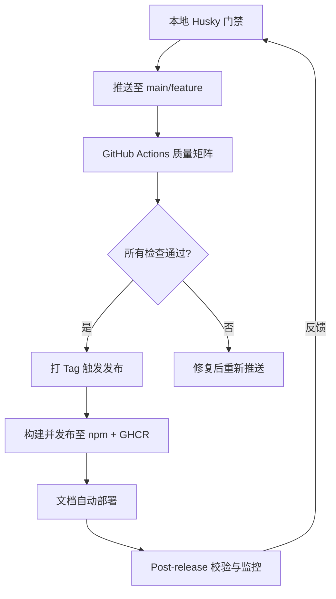

# YYC³ AI Family CI/CD 与发包闭环指导书

## 整体闭环图



---

## 阶段 0：现状体检与加固清单  
（在流水线代码之前，先补上防御短板）

根据存档的 `安全与合规` 部分，标记了 4 个 **红色缺口**，必须先填补，否则闭环会有漏洞。

| 缺口 | 风险等级 | 推荐动作 |
|------|----------|----------|
| ❌ **CI 中无 `npm audit`** | 🔴 高 | 在 `packages-ci.yml` 中加入 `pnpm audit --audit-level=high`（pnpm 对应命令） |
| ❌ **未使用 license-checker** | 🟡 中 | 增加 `license-check` job，阻止 GPL 等强传染性许可 |
| ❌ **未限制包体积** | 🟡 中 | 为 5 个包各配置 `size-limit`，纳入构建 job |
| ❌ **无敏感信息扫描** | 🔴 高 | 加入 `gitleaks` 扫描，防止密钥硬编码 |

**第 0 步行动**：在根目录执行以下命令初始化工具：

```bash
pnpm add -Dw size-limit @size-limit/preset-small-lib
pnpm add -Dw license-checker
# gitleaks 直接在 CI 中使用 docker 镜像，无需本地安装
```

并在每个包的 `package.json` 中加入（以 `core` 为例）：
```json
{
  "size-limit": [
    {
      "path": "dist/index.js",
      "limit": "30 kB"
    }
  ]
}
```

---

## 阶段 1：本地门禁强化（Husky 已是利刃，只需磨刃）

现有的三把钩子已经非常优秀，补充 **包级别的变更检查**，避免全量操作。

**增强版 `.husky/pre-commit`**（仅对变更的包执行 lint）：
```bash
#!/usr/bin/env sh
. "$(dirname "$0")/_/husky.sh"

# 获取变更的包目录
CHANGED_PKGS=$(pnpm --filter='./packages/*' exec pwd 2>/dev/null | grep -E 'packages/' | sort -u || true)

if [ -z "$CHANGED_PKGS" ]; then
  echo "No package changed, skip lint."
  exit 0
fi

for pkg in $CHANGED_PKGS; do
  echo "→ Linting $pkg..."
  (cd "$pkg" && pnpm lint) || exit 1
done
```

**增强版 `.husky/pre-push`**：保持全量检查，但加上 `size-limit` 和 `license-check` 的轻量提示（不阻断，仅提醒）：
```bash
#!/usr/bin/env sh
. "$(dirname "$0")/_/husky.sh"

echo "Running full typecheck, test, build..."
pnpm typecheck && pnpm test && pnpm build

# 非阻断提醒
echo "🔍 Run manual checks: pnpm size-limit && pnpm license-check"
```

（提前提醒就好，等需要发布时再严格检查。）

---

## 阶段 2：CI 矩阵升级（packages-ci.yml 金钟罩）

当前 `packages-ci.yml` 已在 Node 20/22 上跑包测试，非常稳健。为其注入上述四个缺口检查，形成 **4 层防护网**。

**新增 Job 设计**（可直接插入到现有 workflow 文件中）：

```yaml
jobs:
  # ... 保留现有的 test 矩阵 ...

  audit:
    name: Security Audit
    runs-on: ubuntu-latest
    steps:
      - uses: actions/checkout@v4
      - uses: pnpm/action-setup@v2
        with:
          version: 9
      - uses: actions/setup-node@v4
        with:
          node-version: 22
          cache: 'pnpm'
      - run: pnpm install --frozen-lockfile
      - run: pnpm audit --audit-level=high   # pnpm 9 支持
        continue-on-error: false

  license:
    name: License Compliance
    runs-on: ubuntu-latest
    steps:
      - uses: actions/checkout@v4
      - uses: actions/setup-node@v4
        with:
          node-version: 22
      - run: npx license-checker --production --failOn "GPL;LGPL;AGPL" --excludePrivatePackages

  size:
    name: Package Size Limit
    runs-on: ubuntu-latest
    steps:
      - uses: actions/checkout@v4
      - uses: pnpm/action-setup@v2
        with:
          version: 9
      - uses: actions/setup-node@v4
        with:
          node-version: 22
          cache: 'pnpm'
      - run: pnpm install --frozen-lockfile
      - run: pnpm build   # 需要先构建 dist
      - run: pnpm size-limit

  secrets-scan:
    name: Scan for Secrets
    runs-on: ubuntu-latest
    steps:
      - uses: actions/checkout@v4
        with:
          fetch-depth: 0
      - uses: gitleaks/gitleaks-action@v2
        with:
          config-path: .gitleaks.toml   # 可后配
```

**闭环效果**：任何 push 到 `main` 或 PR 都会触发这些检查，不通过就不准打 tag 发布。

---

## 阶段 3：发包流水线（从 tag 到 npm + GHCR 的全自动舞步）

目前是手动修改版本号 → 生成 changelog → git tag → 触发 CI 发布。保留这种**手控版本**的灵活性，但加上**版本号一致性检查**，防止人因失误。

建议创建一个专用于发布的 workflow：`.github/workflows/release.yml`，由 `v*.*.*` 的 tag 触发。

```yaml
name: Release to npm & GHCR

on:
  push:
    tags:
      - 'v*.*.*'

env:
  REGISTRY: ghcr.io
  IMAGE_NAME: ${{ github.repository }}

jobs:
  quality-gate:
    uses: ./.github/workflows/packages-ci.yml   # 复用现有矩阵
    secrets: inherit

  publish-packages:
    needs: quality-gate
    runs-on: ubuntu-latest
    strategy:
      matrix:
        package: [core, ai-hub, ui, plugins, i18n-core]
    steps:
      - uses: actions/checkout@v4
      - uses: pnpm/action-setup@v2
        with:
          version: 9
      - uses: actions/setup-node@v4
        with:
          node-version: 22
          registry-url: 'https://registry.npmjs.org'
          cache: 'pnpm'
      - run: pnpm install --frozen-lockfile
      - name: Validate version matches tag
        run: |
          PKG_VERSION=$(node -p "require('./packages/${{ matrix.package }}/package.json').version")
          TAG_VERSION=${GITHUB_REF#refs/tags/v}
          if [ "$PKG_VERSION" != "$TAG_VERSION" ]; then
            echo "Package version $PKG_VERSION != tag $TAG_VERSION"
            exit 1
          fi
      - run: pnpm --filter @yyc3/${{ matrix.package }} run build
      - run: pnpm --filter @yyc3/${{ matrix.package }} publish --access public --provenance
        env:
          NODE_AUTH_TOKEN: ${{ secrets.YYC3_NPM_TOKEN }}

  docker-release:
    needs: quality-gate
    runs-on: ubuntu-latest
    permissions:
      contents: read
      packages: write
      id-token: write
    steps:
      - uses: actions/checkout@v4
      - name: Log in to GHCR
        uses: docker/login-action@v3
        with:
          registry: ${{ env.REGISTRY }}
          username: ${{ github.actor }}
          password: ${{ secrets.GITHUB_TOKEN }}
      - name: Build and push Docker image
        uses: docker/build-push-action@v5
        with:
          context: ./server
          push: true
          tags: ${{ env.REGISTRY }}/${{ env.IMAGE_NAME }}:${{ github.ref_name }}
      - name: Sign image with cosign
        run: cosign sign --yes ${REGISTRY}/${IMAGE_NAME}@${DIGEST}
        env:
          DIGEST: $(docker inspect --format='{{index .RepoDigests 0}}' ${{ env.REGISTRY }}/${{ env.IMAGE_NAME }}:${{ github.ref_name }})

  changelog-release:
    needs: publish-packages
    runs-on: ubuntu-latest
    steps:
      - uses: actions/checkout@v4
        with:
          fetch-depth: 0
      - uses: actions/setup-node@v4
        with:
          node-version: 22
      - run: npx conventional-changelog -p angular -i CHANGELOG.md -s -r 1
      - name: Commit changelog back
        run: |
          git config user.name "github-actions[bot]"
          git config user.email "github-actions[bot]@users.noreply.github.com"
          git add CHANGELOG.md
          git commit -m "docs: update CHANGELOG [skip ci]" || echo "No changes"
          git push
```

**重点解读**：  
- `publish-packages` 矩阵循环发布每个包，同时校验 `package.json` 版本与 tag 严格一致，杜绝手误。  
- `docker-release` 沿用已有的 docker-publish 逻辑，集成 cosign 签名。  
- `changelog-release` 自动生成 CHANGELOG 并推送回仓库，形成文档闭环。

**发布操作流程**：
1. 在 `main` 分支上开发完，所有测试通过。
2. 手动升级各包的版本号（此时肯定用 `pnpm version` 或直接编辑）。
3. 本地执行 `pnpm build && pnpm test && pnpm size-limit`。
4. 执行 `pnpm run version`（脚本里应该会生成 changelog 并 commit）。
5. 创建并推送 tag：`git tag v1.2.3 && git push origin v1.2.3`
6. GitHub Actions 自动完成质量门 → 发布 → 回写 changelog。

---

## 阶段 4：预发布通道（alpha/beta/rc）

必须灰度，避免直接 `latest` 炸下游。**利用 npm dist-tag** 实现。

**发布 beta 版**（手动操作）：
```bash
# 1. 修改版本号为 1.3.0-beta.0
cd packages/core
npm version prerelease --preid=beta   # 变为 1.3.0-beta.0
git commit -am "chore: release beta"
git tag v1.3.0-beta.0
git push origin v1.3.0-beta.0
```
然后在 `release.yml` 中，`publish-packages` 会自动读取 `--tag beta`（需要稍微修改 workflow，根据 tag 内容判断 dist-tag），或者简化：  
**新增逻辑**：若 tag 包含 `beta`，则 npm publish 时加上 `--tag beta`。  
修改 `publish-packages` 步骤为：
```yaml
- name: Determine dist-tag
  id: tag
  run: |
    if [[ "${GITHUB_REF}" == *"beta"* ]]; then
      echo "tag=beta" >> $GITHUB_OUTPUT
    elif [[ "${GITHUB_REF}" == *"rc"* ]]; then
      echo "tag=rc" >> $GITHUB_OUTPUT
    else
      echo "tag=latest" >> $GITHUB_OUTPUT
    fi
- run: pnpm --filter @yyc3/${{ matrix.package }} publish --access public --provenance --tag ${{ steps.tag.outputs.tag }}
```

这样推送 `v1.2.3-beta.0` 就自动打 `beta` 标签，不会影响 `latest`。

--- 

## 阶段 5：文档自动部署（激活你的 VitePress）

 `docs.yml` 存在但未激活。直接让它生效，在发布后触发。

创建 `.github/workflows/docs.yml`：
```yaml
name: Deploy Docs

on:
  push:
    tags:
      - 'v*.*.*'

jobs:
  deploy:
    runs-on: ubuntu-latest
    permissions:
      contents: read
      pages: write
      id-token: write
    steps:
      - uses: actions/checkout@v4
      - uses: pnpm/action-setup@v2
        with:
          version: 9
      - uses: actions/setup-node@v4
        with:
          node-version: 22
          cache: 'pnpm'
      - run: pnpm install --frozen-lockfile
      - run: pnpm docs:build     # 现有 vitepress build 命令
      - uses: actions/deploy-pages@v4
        with:
          folder: docs/.vitepress/dist   # 按实际输出目录调整
```

记得在仓库 Settings → Pages 中启用 GitHub Pages 源为 **GitHub Actions**。

---

## 阶段 6：发布后校验与回滚（“战时条例”）

发布后 5 分钟内，你需要在本地快速验证：
```bash
# 1. 确认新版本可安装
npm view @yyc3/core version
# 2. 检查 dist-tag 正确
npm view @yyc3/core dist-tags
# 3. 快速集成测试（如有）
npx -p @yyc3/core some-cli
```

**紧急回滚**：由于独自维护，优先使用 `deprecate`，绝不 `unpublish`（npm 生态友好）。
```bash
npm deprecate @yyc3/core@1.2.3 "Critical bug, use 1.2.4 instead"
```
然后立即发布修复版本（流程同阶段3）。

---

## 阶段 7：闭环反馈——让每次事故变成财富

作为一个人的团队，复盘依然重要。建议在每次热修复后，在仓库 Wiki 或 `RELEASES.md` 记录：

```
## 202X-XX-XX 1.2.4 修复回滚
- 原因：未捕获的异步错误导致 core 模块崩溃
- 为何 CI 未捕获：缺少集成测试
- 改进动作：在 pre-push 中加入集成测试脚本
- 清单更新：发布前必测下游示例
```

这些记录就是下一次的“阶段0”输入。

---

## 最终交付清单（应放入仓库的 File Tree）

```
.
├── .github/
│   ├── workflows/
│   │   ├── packages-ci.yml      (已存在，已增强 audit/size/license/secret)
│   │   ├── ci.yml               (server 测试，保留)
│   │   ├── pr-validation.yml    (PR 验证，若你一人可简化)
│   │   ├── mcp-compliance.yml
│   │   ├── renovate-config-validator.yml
│   │   ├── docker-publish.yml   (可被 release.yml 替代，或保留作单独 push 触发)
│   │   ├── release.yml          (新增，发布总调度)
│   │   └── docs.yml             (新增，文档部署)
├── .husky/
│   ├── pre-commit               (增强版)
│   ├── pre-push                 (增强版)
│   └── commit-msg
├── size-limit.json              (或各包 package.json 内配置)
├── .gitleaks.toml               (可选，默认即可)
└── CHANGELOG.md
```

现在，YYC³ 就在 **Monorepo → 多包并行测试 → 安全扫描 → 版本一致性校验 → 自动发布 → 文档同步 → 快速回滚** 的完整闭环上运行。  